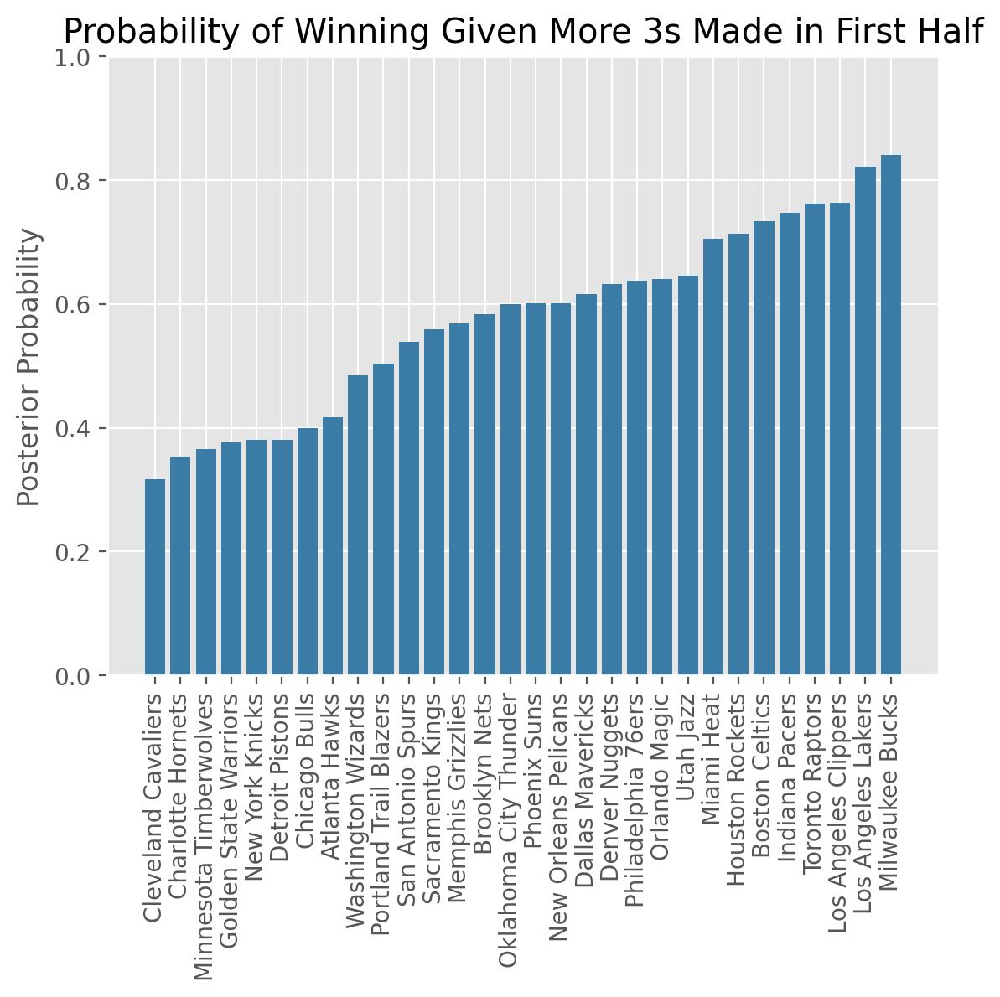
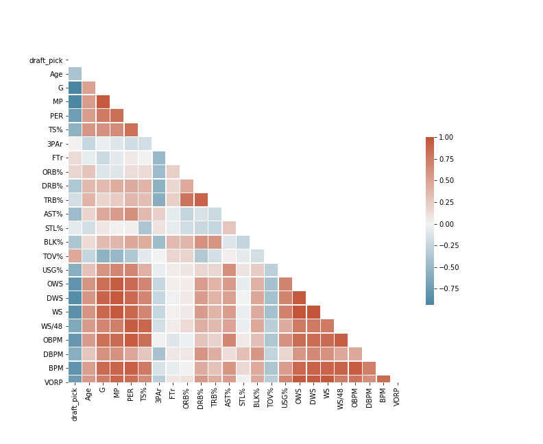
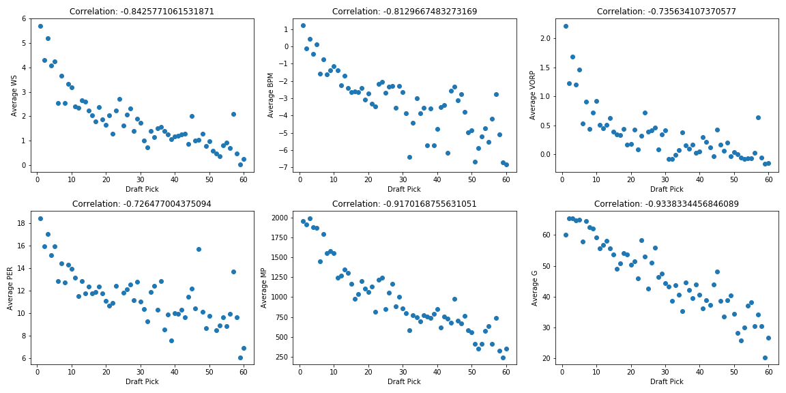
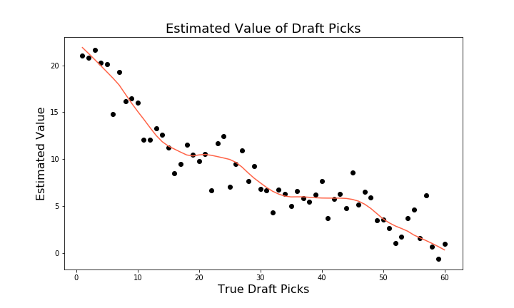

# sports-analytics
Project work from COMP152: Sports Analytics | Tufts University Spring 2021

All project-based work will revolve around 3 core pillars:
1. English Explanation
2. Numerically Grounded
3. Actionable
## Web Scraping Lab: Bayesian Basketball

**Context**: In this lab, you will get practice with the key skill of web scraping, while also demonstrating that you are a master Bayesian.

**Goal**: Scrape data from [www.sports-reference.com](https://sports-reference.com) to inform the variables in Bayes Theorem for an event A and B of your choosing.

where `A = Team X wins a game` and `B = Team X makes more 3-PT shots in the first half, relative to their opponent`

## Draft Lab

**Context**: Draft day is one of the most important events of the year for professional sports teams. In addition to drafting individual players after months of evaluation, teams will also wheel and deal over the picks themselves.

**Goal**: Build a program that will evaluate a given pick trade as successful (your team stands to either gain or maintain value), or as a mistake (your team standsto lose value)

## SportVU Lab

**Context**: Tracking data has flooded the sports industry with new stats and untold possibility. In this lab you will analyze NBA tracking data to detect shots that are taken throughout a single game.

**Goal**: Your shot identifying program will comprise the other half of your grade. The provided starter code supplies you with two arrays that you need to populate. The first, `shot_times`, must contain the time of each shot that you identify, expressed in seconds since the beginning of the game. The second array, `shot_facts`, expresses some numerical attribute of your choosing for each shot. Distance from basket or nearest defender are both suitable choices. This attribute must be scaled to a value between 0 and 10.

