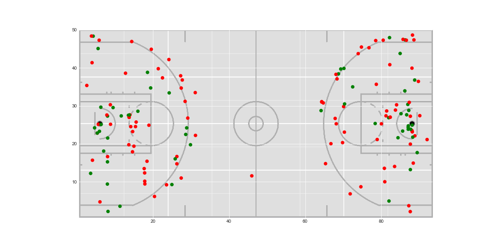
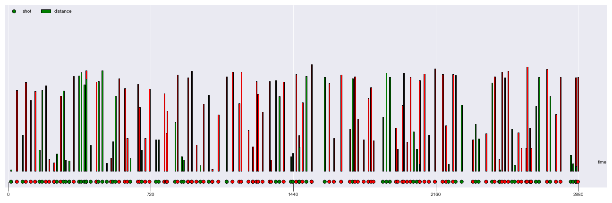
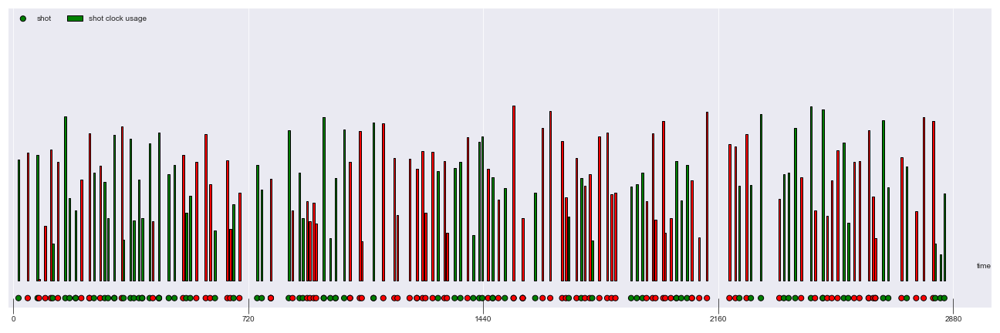

# sports-analytics
COMP152: Sports Analytics

All project-based work will revolve around 3 core pillars:
1. English Explanation
2. Numerically Grounded
3. Actionable
## Web Scraping Lab: Bayesian Basketball

**Goal**: Scrape** data from [www.sports-reference.com](https://sports-reference.com) to inform the variables in Bayes Theorem for an event A and B of your choosing.

$$ P(A|B) = \frac{P(B|A)P(A)}{P(B|A)P(A) + P(B|¬A)P(¬A)}$$

where $A = \text{Team X wins a game}$ and $B = \text{Team X makes more 3-PT shots in the first half, relative to their opponent}$   

## Draft Lab

**Goal**: Build a program that will evaluate a given pick trade as successful (your team stands to either gain or maintain value), or as a mistake (your team standsto lose value)

## SportVU Lab

**Context**: Tracking data has flooded the sports industry with new stats and untold possibility. In this lab you will analyze NBA tracking data to detect shots that are taken throughout a single game.

**Goal**: Your shot identifying program will comprise the other half of your grade. The provided starter code supplies you with two arrays that you need to populate. The first, `shot_times`, must contain the time of each shot that you identify, expressed in seconds since the beginning of the game. The second array, `shot_facts`, expresses some numerical attribute of your choosing for each shot. Distance from basket or nearest defender are both suitable choices. This attribute must be scaled to a value between 0 and 10.

